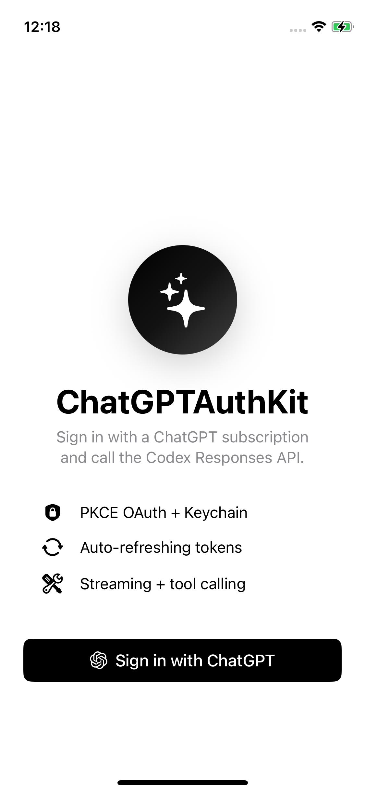

# chatgpt_auth_kit (Flutter)

Sign in with a ChatGPT subscription and call the Codex Responses API from your Flutter app. Pure Dart, no native bridge required.

<p align="center">
  
</p>

**Zero third-party SDK dependencies.** Auth, secure-storage credentials, auto-refresh, and minimal Responses / Models / Usage clients. To plug into another OpenAI client (`dart_openai`, raw `package:http`, etc.), see [Plugging in other OpenAI SDKs](#plugging-in-other-openai-sdks).

## Install

```yaml
dependencies:
  chatgpt_auth_kit: ^0.1.0
```

Transitively pulls `flutter_secure_storage`, `url_launcher`, `crypto`, `http`.

## iOS setup

In `ios/Runner/Info.plist`:

```xml
<key>NSAppTransportSecurity</key>
<dict>
    <key>NSAllowsLocalNetworking</key>
    <true/>
</dict>
<key>NSLocalNetworkUsageDescription</key>
<string>Used to receive the OAuth callback on 127.0.0.1:1455.</string>
```

## Usage

```dart
import 'package:chatgpt_auth_kit/chatgpt_auth_kit.dart';

final flow = OAuthFlow();
final store = CredentialsStore();

Future<Credentials> login() async {
  final creds = await flow.run(); // launches system browser by default
  await store.save(creds);
  return creds;
}
```

If you want to present an in-app browser yourself (recommended on iOS):

```dart
final creds = await flow.run(
  present: (url) async {
    // Show a SafariViewController-style page using webview_flutter_plus or
    // flutter_inappwebview, passing `url`.
  },
  onComplete: () async {
    // Close the in-app browser.
  },
);
```

## Auto-refresh

For long-lived sessions, wrap credentials in a `RefreshingCredentialsProvider` once at app start. It hands out fresh credentials on demand, persists each refresh to secure storage, and coalesces concurrent refreshes:

```dart
final provider = RefreshingCredentialsProvider(creds, store: store);
final chat   = ResponsesClient(provider: provider);
final models = ModelsClient(provider: provider);
final usage  = UsageClient(provider: provider);
```

Every `.fetch()` / `.stream(...)` call goes through the provider, so a near-expiry token is refreshed before the request goes out — you never have to call `OAuthClient.refresh(...)` yourself. For one-off use, each client also has a `.fromCredentials(...)` constructor that takes a single `Credentials` value.

## Streaming a completion

```dart
final client = ResponsesClient(provider: provider);
await for (final event in client.stream([
  Message(role: Role.system, content: 'You are helpful.'),
  Message(role: Role.user,   content: "What's a fun weekend in Berlin?"),
])) {
  if (event is DeltaEvent) stdout.write(event.text);
}
```

## Discover available models

```dart
final models = await ModelsClient(provider: provider).fetch();
for (final m in models) print('${m.slug}  ${m.displayName ?? ""}  default=${m.isDefault}');
```

## Read plan & quota

```dart
final usage = await UsageClient(provider: provider).fetch();
print('plan=${usage.planType} primary=${usage.primary?.usedPercent}');
```

## Plugging in other OpenAI SDKs

The built-in `ResponsesClient` is intentionally minimal (text streaming + usage). If you'd rather use a different HTTP layer or a future `dart_openai` Responses-API binding, point it at the Codex backend with the right headers and body shape. ChatGPTAuthKit gives you the credentials; the integration is config in your app.

**Where it lives**
- Host: `chatgpt.com`
- Base path: `/backend-api/codex`
- Bearer token: `credentials.accessToken`

**Headers Codex requires**
- `Authorization: Bearer <accessToken>`
- `ChatGPT-Account-ID: <accountID>`
- `OpenAI-Beta: responses=experimental`
- `originator: codex_cli_rs` (or your app's identifier)

**Body shape Codex enforces** — a 400 if any of these is wrong
- `instructions: String`
- `reasoning: { effort, summary }`
- `include: ["reasoning.encrypted_content"]`
- `store: false`
- `input` as a structured array — system messages collapse into `instructions`, user/assistant become `{type: "message", role, content: [{type: "input_text"|"output_text", text}]}`

### Example: package:http

Drop these helpers anywhere in your app:

```dart
import 'dart:convert';
import 'package:http/http.dart' as http;
import 'package:chatgpt_auth_kit/chatgpt_auth_kit.dart';

const codexBaseUrl = 'https://chatgpt.com/backend-api/codex';

Map<String, String> codexHeaders(Credentials credentials, {String originator = 'codex_cli_rs'}) {
  return {
    'Authorization': 'Bearer ${credentials.accessToken}',
    'OpenAI-Beta': 'responses=experimental',
    'originator': originator,
    if (credentials.accountID.isNotEmpty) 'ChatGPT-Account-ID': credentials.accountID,
  };
}

Map<String, dynamic> codexQueryBody({
  required String prompt,
  String model = 'gpt-5.5',
  String instructions = "Follow the user's instructions.",
  String reasoningEffort = 'medium',
  bool stream = true,
}) {
  return {
    'model': model,
    'input': [
      {
        'type': 'message',
        'role': 'user',
        'content': [{'type': 'input_text', 'text': prompt}],
      }
    ],
    'instructions': instructions,
    'reasoning': {'effort': reasoningEffort, 'summary': 'auto'},
    'include': ['reasoning.encrypted_content'],
    'store': false,
    'stream': stream,
  };
}
```

Then send a request:

```dart
final creds = await provider.currentCredentials();
final res = await http.post(
  Uri.parse('$codexBaseUrl/responses'),
  headers: {...codexHeaders(creds), 'Content-Type': 'application/json'},
  body: jsonEncode(codexQueryBody(prompt: 'Say hi.')),
);
```

Tools, function calling, and multi-turn conversation state are surface area of whichever client library you pick — Codex's body-shape and header rules above apply equally to those flows.

## License

MIT.
